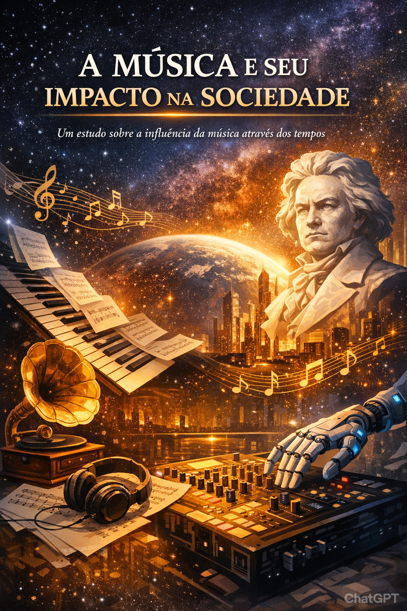

  

# 🎵 A Música e Seu Impacto na Sociedade

Projeto desenvolvido com apoio de Inteligência Artificial para produção de um eBook técnico em formato A4 (5 páginas completas).

---

## 📘 Sobre o eBook

Este material apresenta uma análise técnica sobre:

- Fundamentos estruturais da música  
- Música clássica e desenvolvimento histórico  
- Impacto cognitivo e neurocientífico  
- Música como estrutura social  

O conteúdo foi desenvolvido com abordagem acadêmica e organização formal.

---

## 🤖 Tecnologias Utilizadas

- **ChatGPT** → Estruturação, aprofundamento técnico e geração do PDF, criação da capa do projeto  
- **Leonardo AI** → Criação da arte da capa do ebook  

---

## 📂 Arquivos do Projeto

- 📘 Ebook completo em PDF  
- 📄 Documento explicando o processo de criação  

---

## 🚀 Objetivo do Projeto

Demonstrar aplicação prática de IA generativa na criação de material educacional estruturado.

---

## 💡 Aprendizados

- Uso estratégico de IA para produção acadêmica  
- Estruturação técnica de conteúdo  
- Organização de projeto para portfólio  
